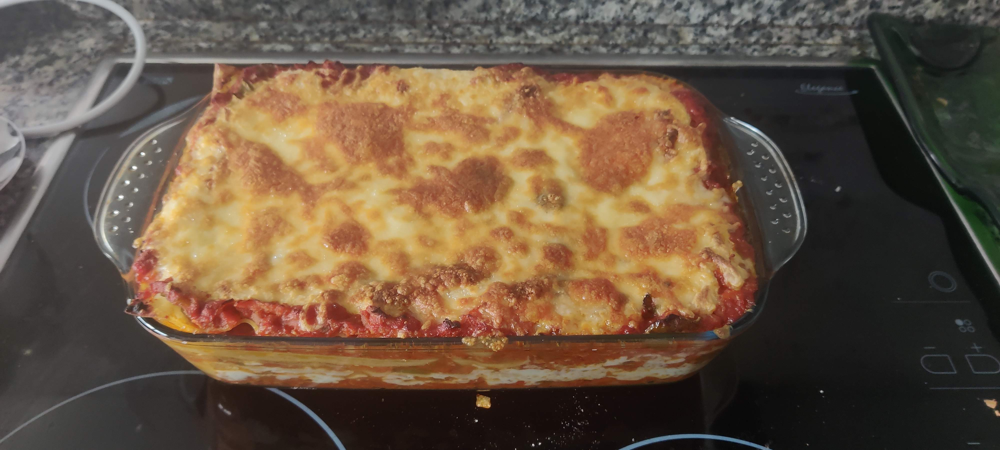

# Lasagna de carne

- Más o menos para 4 personas. Recomiendo hacerla y dejarla reposar mínimo 5 o 6 horas; ni te cuento si es para el día siguiente.

## Ingredientes

- 800gr tomate triturado  
- 300gr zanahorias (4u)
- 150gr apio (2u)
- 300gr cebolla (1u)
- 500gr carne picada 
- 50gr mantequilla
- 50gr harina
- 500ml leche 
- 9 Placas lasaña

---
## Preparación

1. En una olla, poner a hervir el tomate triturado a fuego medio-alto.

2. Mientras, en una sartén sofríes las verduras. Cuando tengan color, a la olla con el tomate.

3. En la misma sartén fríes la carne. Puede ser 100% vaca o 50% cerda, como tú. Lo que te permita tu religión. Añadirla a la olla cuando aún le quede un poco de crudo, para que termine de hacerse con los jugos del tomate y las verduras.

4. Dejar hirviendo hasta que el tomate reduzca. Sal y pimienta al gusto; para reducir la acidez del tomate, azúcar.

5. Paralelamente, empezamos con la [bechamel](bechamel.md). Si no sabes hacerla espabila. 

6. Con las placas haces lo que te pida la caja: remojarlas, hervirlas, etc.

7. Precalentar el horno a 225 ºC.

8. Orden para montar la lasagna: salsa → placa → salsa → bechamel → queso → placa → salsa → bechamel → placa → salsa → bechamel. Un consejo: haz capas con poca cantidad para que tenga mejor forma y consistencia.

9. Meter la lasaña al horno tapada con papel albal, 15–20 min. Sacarla, poner queso y dejarla 5 min más con la opción de gratinar.

---
