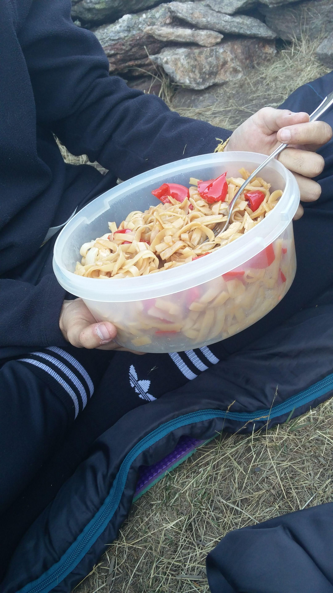

# Tallarines con salsa teriyaki

## Ingredientes

- Tallarines, los mejores que he probado son [pinchame ;\)](https://info.mercadona.es/es/consejos/alimentacion/noodles-de-arroz-para-tus-recetas-asiaticas/tip) 200 gr
- Pimiento rojo
- 2 pimientos italianos
- Cebolla
- Pechuga de pollo por cabesa
- [Salsa teriyaki](https://tienda.mercadona.es/product/17362/salsa-teriyaki-hacendado-botella)

---
## Preparación

1. Cortar las verduras y la cebolla, y hacerlas en la sartén.

2. Cuando estén blandicas, añadir la carne. Para desglasar, puedes echarle vino blanco.

3. En una olla, hacer los tallarines. Si lo haces antes de tener las verduras se van a quedar pegados al pasar los minutos.

4. Cuando tengas todo hecho, lo mezclas en la olla de los tallarines, sin el agua hirviendo, y le echas salsa teriyaki al gusto de consumidor. Normalmente, si echas todo el paquete de tallarines, suele ser un poco más de la mitad del bote.

5. Remover con fuego medio y ya lo tienes. Simple

---

