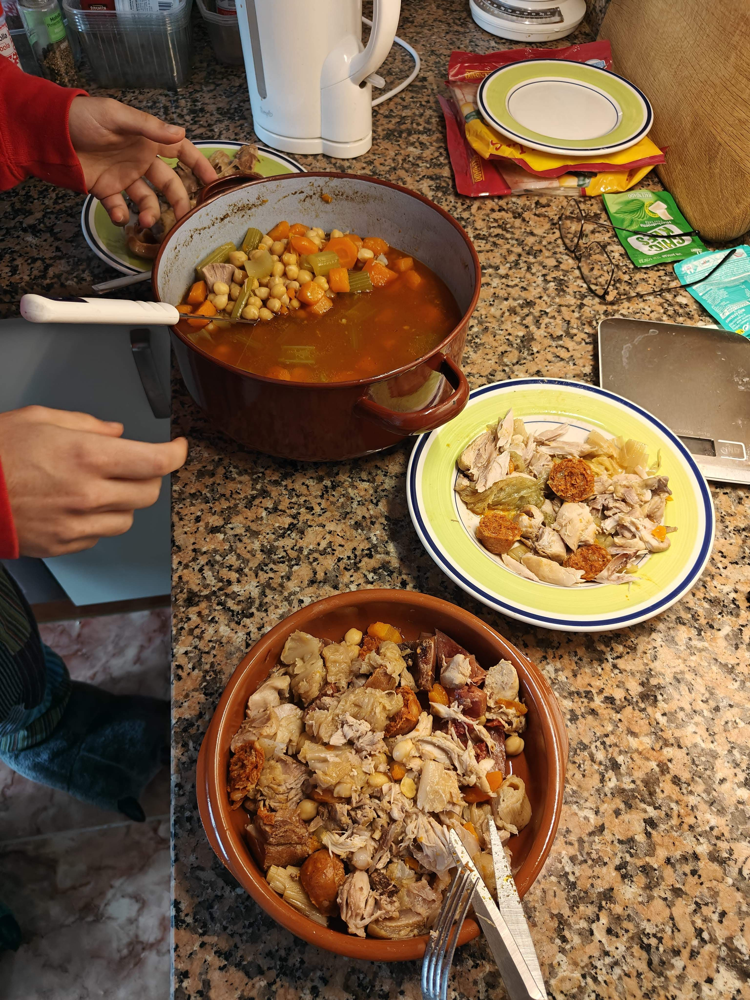

# Cocido

## Ingredientes

- 300gr de garbanzos
- 3 o 4 zanahorias
- 1/4 de repollo
- 3 o 4 ramas de apio
- Puerro
- Espinazo de cerdo
- Hueso de jamón
- Hueso de vaca o de tu madre
- (Opcional) Hueso saladao
- Carcasa de pollo
- 3 0 4 muslos de pollo
- Chorizo
- (Opcional) Morzilla

## Preparación

1. Dejar en remojo los garbanzos la noche de antes o 12 horas.

2. Pelar y trocear las zanahorias (mejor en trozos grandes). Hacer lo mismo con el apio. Preparar el puerro y el repollo.

3. En una olla, echar en el fondo el espinazo y los huesos; luego los muslos, las verduras y, por último, colar y añadir los garbanzos. Se hace así para aprovechar mejor el espacio.

4. Puedes echar el chorizo ahora si quieres. Los “expertos” dicen que hay que echarlo cuando quede una hora de cocción para que no suelte mucha grasa. En mi opinión no hace falta, pero sí si echas morcilla, porque si no se deshace y te quedas sin morcilla.

5. Con todo metido en la olla, echar agua hasta cubrirlo todo y darle fuego.

6. Quitar la espuma que salga con una espumadera. Cuando empiece a hervir, dejarlo hasta que no salga más espuma.

7. Taparlo y dejarlo a fuego medio-bajo al menos 2 horas y 15 minutos, hasta que el garbanzo esté a tu gusto. Por último, echarle sal.

## Foto
