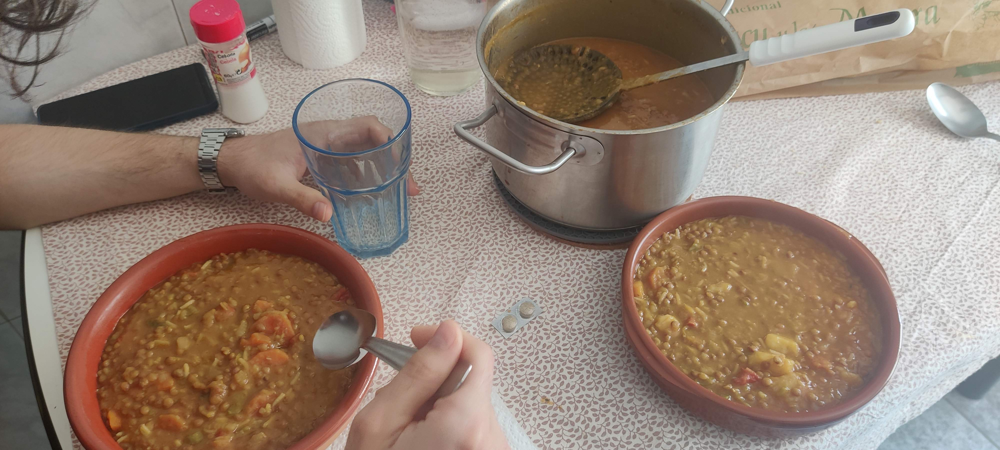

# Lentejas

## Ingredientes

- 300gr lentejas  
- 300gr zanahorias (4u)
- 450gr cebolla (2u)
- 100gr arroz
- Puerro
- Pimiento rojo
- Pimietos verdes
- 2 Patatas medianas
- 4 Dientes de ajo
- Chorizo
- Pimentón de la vera
- Comino
 
---
## Preparación

1. En una olla, sofreír primero el ajo hasta que coja color. Después añadir: cebolla, zanahoria, pimientos, patatas cortadas y el puerro entero y limpio.

2. Cuando las verduras estén un poco pochadas, puedes añadir dos cucharadas pequeñas de tomate concentrado. Añade también las lentejas.

3. Cuando el tomate concentrado coja color, añade las especias (pimentón y comino) sin pasarte.

4. Cocina las especias unos minutos para que suelten sabor.

5. Añade agua hasta cubrir y deja tres dedos por encima, porque parte se evaporará y luego añadiremos arroz, que absorberá líquido.

6. Cuando rompa a hervir, baja el fuego y tapa. A los 40 minutos deberían estar las lentejas.

7. Cuando estén blandas, separa: el puerro entero, un poco de verduras, lentejas y patatas. Bátelo todo para obtener una pasta que dará melosidad al guiso.

8. Reserva la pasta. Añade el arroz a la olla.

9. Cuando esté hecho, añade la pasta/mezcla y ya tienes las lentejas listas.

---
